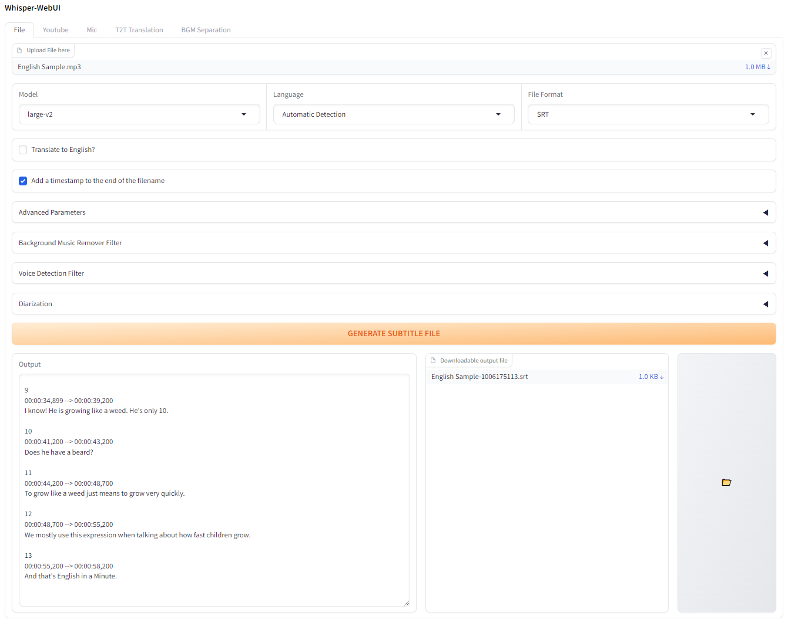

# Whsiper-WebUI
A Gradio-based browser interface for Whisper.

# Feature
Generate subtitles from various sources, including :
- Files
- Youtube
- Microphone

Currently supported subtitle formats : 
- SRT
- WebVTT

# Installation and Running
## Prerequisite
To run Whisper, you need to have `python` version 3.8 to 3.10, `ffmpeg`, and `git` installed on your system. The reason `git` is required is because I am currently using a custom version of `whisper` for my WebUI.

Please follow the links below to install the necessary software:
- python : [https://www.python.org/downloads/](https://www.python.org/downloads/)
- ffmpeg :  [https://ffmpeg.org/download.html](https://ffmpeg.org/download.html)
- git : [https://git-scm.com/book/en/v2/Getting-Started-Installing-Git](https://git-scm.com/book/en/v2/Getting-Started-Installing-Git)

## Automatic Installation

1. Run `install.bat` from Windows Explorer as a regular, non-administrator user.
2. After installation, run the `launch.bat`.
3. Open your web browser and go to `http://localhost:7860`

## Support

If you found this project useful, kindly consider supporting it.

